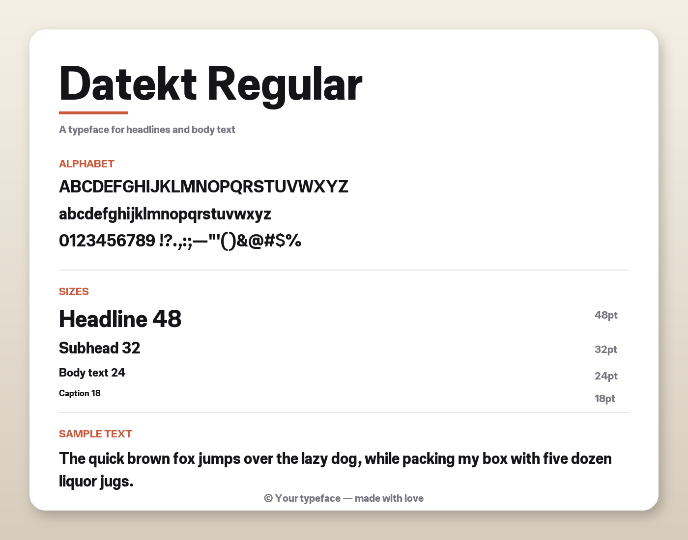
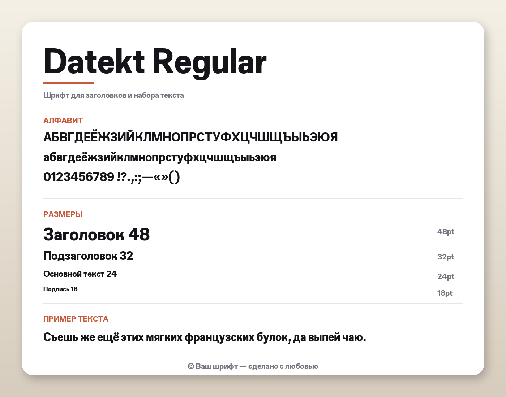
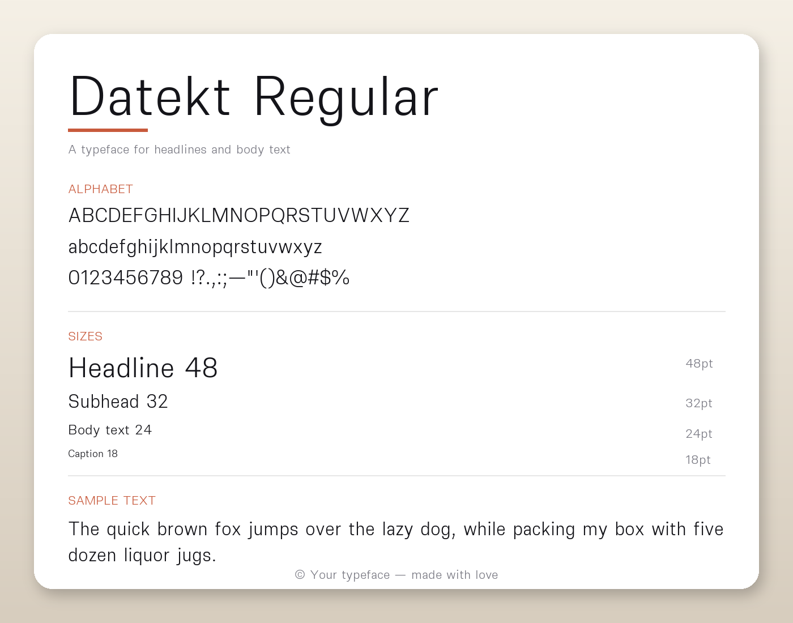

# Шрифт Datekt

Открытый шрифтовый набор, разработанный в рамках **Datekt Consortium**.
Создан для идеального использования как в заголовках, так и в основном
тексте.

## Предпросмотры

### Стиль Regular / Bold

| Латиница | Кириллица |
| :---: | :---: |
|  |  |

### Стиль Thin / Light

| Латиница | Кириллица |
| :---: | :---: |
|  |  |

## Форматы и стили

Шрифт включает два полностью скомпилированных стиля TrueType:

* `Datekt-Regular.ttf`
* `Datekt-Black.ttf`

Поддерживает полную **кириллицу** (включая болгарские и сербские
локализованные формы) и расширенный набор латинских символов, а также
функции OpenType (цифры в старом стиле, дроби и индексы).

## Установка

1. Скачайте файлы `.ttf` из папки [datekt_fonts](https://github.com/datekt/.github/tree/main/fonts/datekt_fonts).
2. Откройте файлы и нажмите **Установить** в своей операционной системе
   (Windows / macOS / Linux).

## Лицензия

Это программное обеспечение шрифта лицензировано в соответствии с
**SIL Open Font License, Version 1.1**.
Подробности см. в файле [LICENSE](LICENSE).

---

*© 2026 Datekt Consortium. Все права защищены.*
