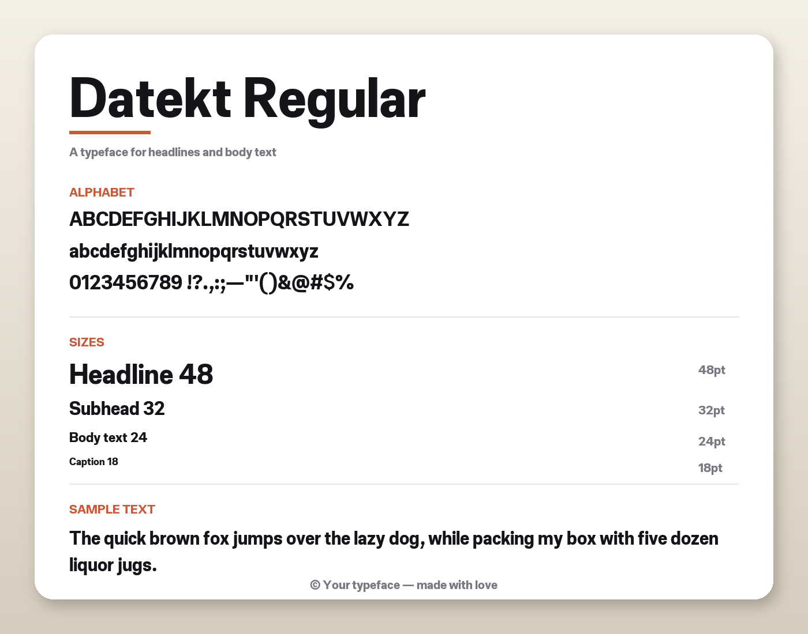
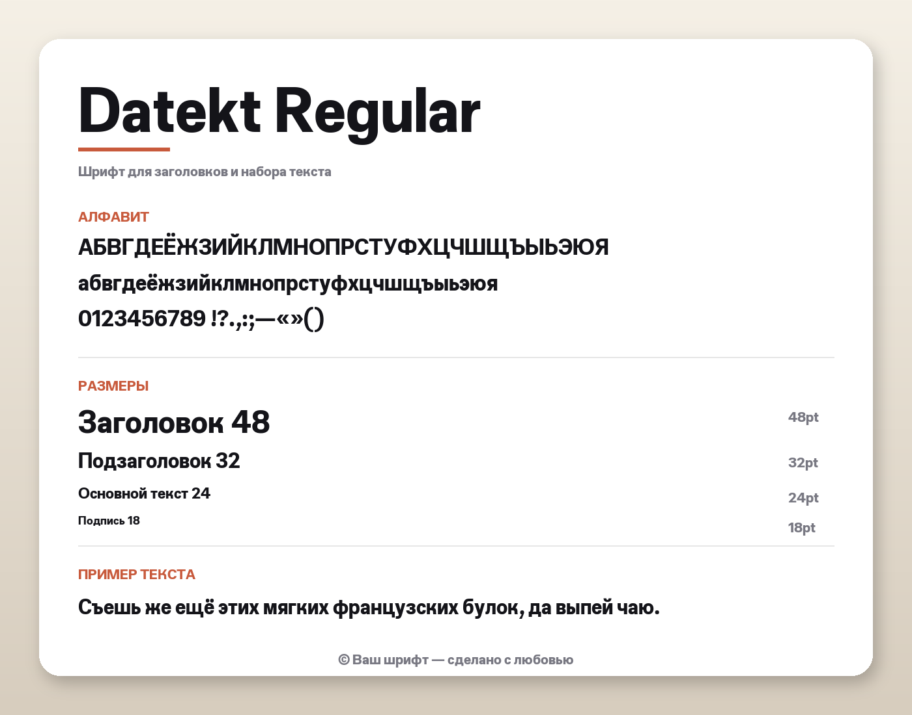
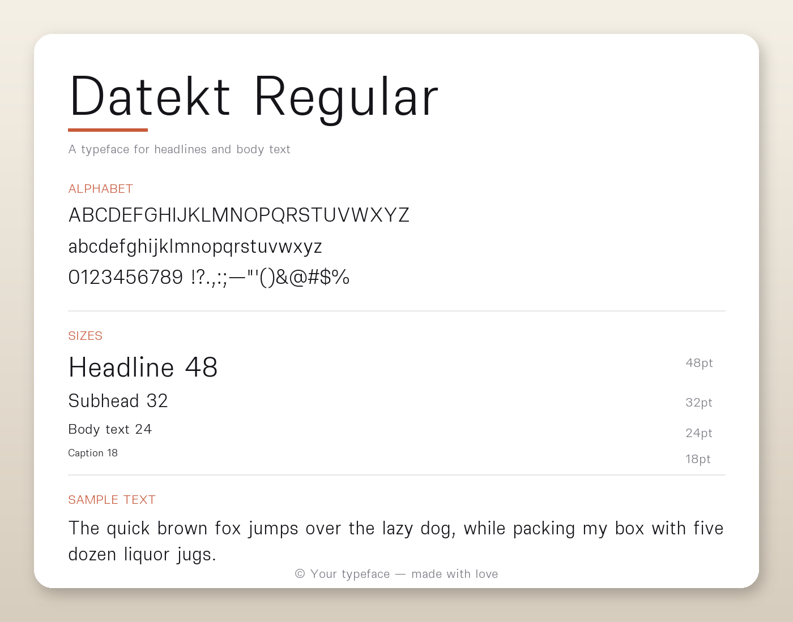
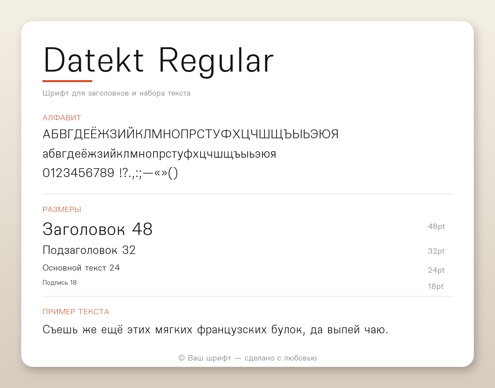

# Datekt Font

An open-source typeface family developed by the **Datekt Consortium**. Designed to perform perfectly in both headers and body text.

## Previews

### Regular / Bold Style

| Latin | Cyrillic |
| :---: | :---: |
|  |  |

### Thin / Light Style

| Latin | Cyrillic |
| :---: | :---: |
|  |  |

## Formats and Styles

The font family includes two fully compiled TrueType styles:

* `Datekt-Regular.ttf`
* `Datekt-Black.ttf`

It features full **Cyrillic** support (including Bulgarian and Serbian localized alternate forms) and an extended Latin character set, along with OpenType features (oldstyle figures, fractions, and indices).

## Installation

1. Download the `.ttf` files from the [datekt_fonts](datekt_fonts) folder.
2. Open the files and click **Install** on your operating system (Windows / macOS / Linux).

## License

This Font Software is licensed under the **SIL Open Font License, Version 1.1**.
For more details, see the [LICENSE](LICENSE) file.

---

*© 2026 Datekt Consortium. All rights reserved.*