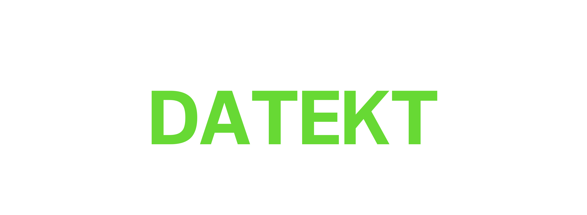

<!-- Главный баннер бренда -->

  

<!-- Декоративная полоса-разделитель -->
***

<!-- Слоган бренда -->
<h3 align="center">Счастливая цифровая жизнь</h3>

  
  
  
  

***

## 🌐 Datekt Media

Добро пожаловать в официальный хаб независимой медиа-команды **Datekt**. Мы создаем то, что приносит удовольствие не только нам, но и пользователям цифровой жизни.

### 📦 Наши ресурсы и Brand Kit
Внутри нашей организации вы можете найти все официальные исходные материалы и их правовой статус:

* 🔤 **[Datekt-Fonts](https://github.com/datekt/.github/tree/main/fonts)** — наши фирменные шрифты (`Datekt-Regular` и `Datekt-Black`).
* 🎨 **[Datekt-Logotype](https://github.com/datekt/.github/tree/main/logotype)** — официальный графический логотип в высоком разрешении формата JPG и PNG.
* 📝 **[Datekt-Name](https://github.com/datekt/.github/tree/main/name)** — репозиторий защиты нашего текстового наименования, закрепляющий за нами права на бренд **Datekt Media**.

---
*© 2026 Datekt Media. Все права защищены. Разработано для людей.*