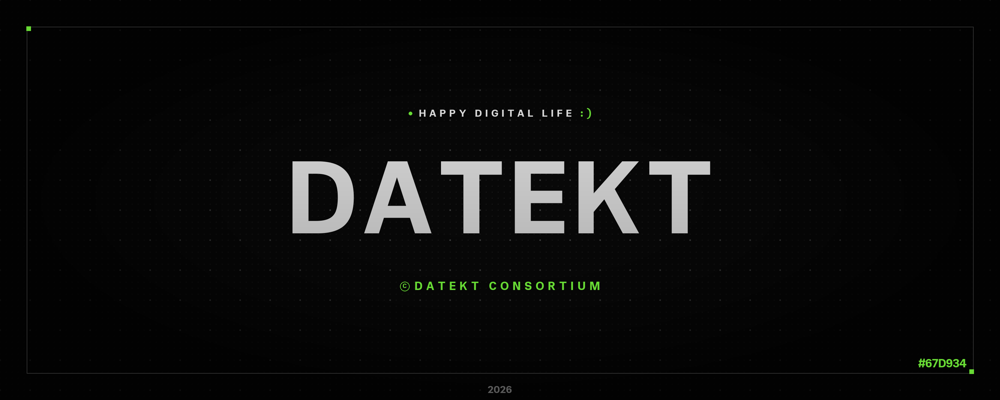

  

***

<h3 align="center">Happy Digital Life :)</h3>

  
  
  
  
  
  

***

## 🌐 Datekt Consortium

Welcome to the official hub of the independent digital team **Datekt**. We create projects that bring joy not only to us, but also to users of the digital world. Join our community — together we’ll make digital life brighter.

---
*© 2026 Datekt Consortium. All rights reserved. Designed for people.*